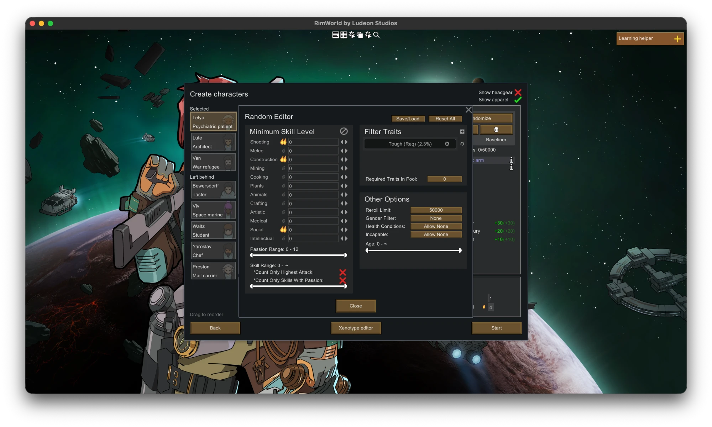
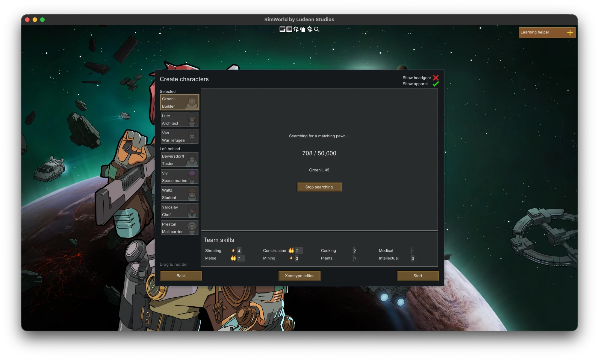
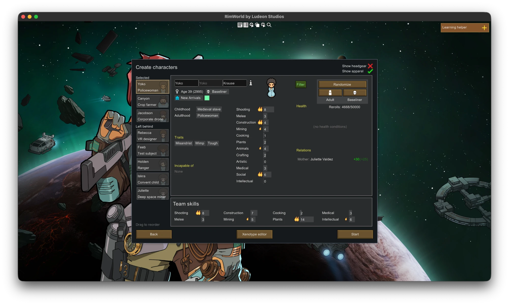

# RandomPlusPlus

[](https://github.com/TrevorS/RandomPlusPlus/actions/workflows/build.yml)

Set a specification for your starting colonists, then hit randomize. It keeps rerolling until a pawn
matches, or until it reaches your reroll limit.



Filter on skill levels and passions, total skill points, traits (required, excluded, or "any N of
these"), age, gender, health conditions and work capability.

RimWorld 1.6 and 1.5 &middot;
requires [Harmony](https://github.com/pardeike/HarmonyRimWorld) &middot;
a fork of [mastertea/RandomPlus](https://github.com/mastertea/RandomPlus)

---

## Build

```sh
make build     # every supported RimWorld version, each verified against its own metadata
make install   # copy it into RimWorld's Mods folder
```

`make` on its own lists the targets. `make check` runs everything CI runs.

Needs the [.NET SDK](https://dotnet.microsoft.com/download) 8.0 or later and nothing else — not even
RimWorld. With no local install the build compiles against
[`Krafs.Rimworld.Ref`](https://www.nuget.org/packages/Krafs.Rimworld.Ref), so it works on a clean
machine and in CI. Set `RIMWORLD_DIR` to build against your own copy instead; common Steam and GOG
locations are found automatically, and the build prints which source it used.

Each build lands in `Resources/<version>/Assemblies/`, which is where RimWorld looks for the one
matching the running game. Harmony is reference-only and deliberately kept out, because the Harmony
mod supplies it at runtime and a second copy would conflict.

Supporting another version means one row in `RandomPlus.csproj`, one in `Tools/build.sh` and one in
`About.xml`. `Tools/package.sh` fails the release if those disagree.

## Layout

```
assets/        icon source. Tools/render-icon.py rasterises it into Resources/.
Source/Core/   the filter and the reroll search. No UnityEngine, no UI, no Harmony.
Source/Game/   Harmony patches, mod-compatibility detection, save file I/O.
Source/UI/     the filter editor window and its panels. UI/EdB is forked code.
Tools/         the checks described below.
```

## How the search works

Each attempt regenerates only the parts of a pawn the filter reads — age, then traits and skills,
then health — and abandons a candidate as soon as one fails. Gear, genes, body type and styling are
generated once, for the pawn that is kept.

Regenerating in place skips RimWorld's outer generation methods, so the mod asks Harmony whether any
other mod has patched them. If one has, the same search rerolls whole pawns instead, and only skips
apparel, weapons and inventory for candidates — which no filter reads. Neither shortcut changes which
pawns the search can produce, only what a discarded one costs.

The search runs in ~25 ms time slices, one per frame, instead of to completion inside the click.
A large reroll limit means seconds of work, and doing it in one GUI event freezes the window — a
beachball on macOS. Sliced, the game keeps drawing, and a search whose window closes finishes its
pawn and stops. Slices fall only between candidates, on the same thread, in the same order — so
slicing changes when the work happens, never what is generated.

While it runs, the pawn's card shows a search panel — live reroll count, candidate names sampled at
a readable pace, and a **Stop searching** button that ends the search early and keeps the pawn it
was on, fully finished — rather than the pawn itself, which mid-search is always part-way through a
reroll and would flicker through half-generated composites. The rest of the page ticks with the
same sample: the pawn's tile in the list and the Team skills summary show the sampled candidate,
never the per-frame churn.





The Filter button turns **green** while a filter is active, and the reroll counter next to
Randomize only appears then — without a filter, randomize is a single vanilla roll and there is
nothing to count.

## Development

| Command | Checks |
| --- | --- |
| `make build` | every version compiles, and its Harmony targets and reflection resolve |
| `make test` | filter and search behaviour |
| `make bench` | per-candidate cost and allocations |
| `make package` | the release zip is complete and loadable |
| `make check` | all of the above, plus formatting and shellcheck — what CI runs |

CI runs the same five on every pull request and on every push to `master`, and the release runs them
before it publishes anything. The Makefile only shells out to `Tools/`, so `make` and CI run the
same commands rather than two things that drift apart.

**CI builds on Linux and macOS.** Not for the assembly — that is identical either way — but for the
tooling around it. macOS has a BSD userland rather than GNU, and `/bin/bash` there is 3.2. Three real
breakages have already come from that gap, so the macOS leg additionally re-runs the scripts under
`/bin/bash` explicitly, since the runner puts a newer bash ahead of it on `PATH`. Both legs install
into a RimWorld tree and uninstall again, which is the only thing that exercises the macOS Mods
folder living inside `RimWorldMac.app` behind a path with spaces in it. A third, dotnet-only leg
builds, verifies and tests on Windows — the platform most contributors are likely to be on — where
the bash-and-make tooling doesn't apply; packaging stays on Linux and macOS.

`make install` copies the built mod into RimWorld's `Mods` folder — Steam and GOG locations are
found automatically on macOS and Linux, including the macOS one inside `RimWorldMac.app`, or set
`RIMWORLD_DIR`. `make uninstall` removes it.

The scripts in `Tools/` are held to bash 3.2, which is what macOS ships, and avoid GNU-only tools.

**Verify** exists because the mod resolves names at runtime — Harmony patch targets, and `GetMethod`
lookups by string. Those fail *quietly* when a game update moves them, which is the usual way a mod
breaks across a RimWorld release. Point it at another version's assemblies to check compatibility
before porting.

**Tests** compile all of `Source/Core` against stubs instead of RimWorld, so a pawn can be built by
hand and the resulting decision asserted. The boundary is enforced rather than described: the test
project has no UnityEngine reference, so core code reaching for the UI fails its build, and a new
core file is covered the moment it exists.

**Bench** stubs pawn generation out to nothing, so it measures the mod's own per-candidate cost, not
the cost of a reroll in the game.

**package.sh** builds the zip and then checks the zip rather than the tree it came from: About.xml
present, no Harmony assembly, an `Assemblies` folder for every version About.xml claims, no build
output. Running it on every push means the release path is exercised continuously instead of first
being tried on a tag.

## Before changing anything

**Three type names are a file format.** `PawnFilter`, `SkillContainer` and `TraitContainer` are
written into the player's saved filters by name, via `LookMode.Deep`. Moving the files is fine;
renaming those three silently breaks saved presets.

**Nothing off the game can check the transpilers.** The two in `Source/Game/HarmonyPatches.cs` match
opcode patterns inside RimWorld method bodies, and reference assemblies carry no IL. If a pattern
stops matching, the injection is skipped silently and the Filter button simply does not appear. Only
running the game catches that — [`docs/SMOKE-TEST.md`](docs/SMOKE-TEST.md) is the list, and it runs
on both supported versions because a match on one says nothing about the other.

**Presets are shared with the original mod.** Both write `Config/RandomPlus.xml`. That is deliberate:
a player switching from RandomPlus keeps their saved filters. It is also why the three type names
above cannot move.

**The built assemblies are committed.** `Resources/` is the mod folder as RimWorld expects it, so
the repository can be cloned straight into `Mods/`. That only holds if every
`Resources/<version>/Assemblies/` is current, so run `make build` before committing a source
change — CI builds from source and cannot tell you a committed binary is stale.

**1.4 and earlier are out of reach, and it is not close.** Compiling `Source/` against each
version's [`Krafs.Rimworld.Ref`](https://www.nuget.org/packages/Krafs.Rimworld.Ref):

| Target | Compile errors | What is missing |
| --- | --- | --- |
| 1.5 | 0 | nothing |
| 1.4 | 3 | `StartingPawnUtility.RandomizePawn` — the patch target itself — plus `GiveAppropriateBioAndNameTo`'s signature and `Dialog_ChooseNewWanderers` |
| 1.3 | ~10 | the above, plus all of Biotech and the `PawnIndex` / `GetGenerationRequest` / `ValidateAndFix` plumbing the in-place path is built on |
| 1.2 | ~15 | the above, plus all of Ideology — no style tracker, beards or tattoos |

1.3 and 1.2 are not a matter of `#if` guards: the search is built on generation plumbing that does
not exist there, so supporting them means a second search, not a guarded first one. And a clean
compile would still say nothing about the transpilers.

## Standards

Every .NET analyser rule is an error. The exceptions live in `.editorconfig`, one per rule with a
reason — almost all of them rules a RimWorld mod cannot follow, such as "no visible instance fields"
when `Scribe_Values.Look` takes its target by `ref`. Formatting is enforced as whitespace only, and
the scripts in `Tools/` are held to shellcheck.

## Releasing

Bump `<Version>` in `RandomPlus.csproj` and `<modVersion>` in `Resources/About/About.xml`, add a
`changelog.txt` entry, then push a tag:

```sh
git tag v1.0.0 && git push origin v1.0.0
```

The release calls the build workflow rather than repeating it, so a tag is gated on the same checks
a push is, plus one more: the tag has to agree with `<modVersion>`. The zip those checks produced is
the zip that gets published — nothing is rebuilt afterwards. It extracts to `RandomPlusPlus/`, which
is a separate folder from the original mod's, so installing this one cannot overwrite that one.

Run [`docs/SMOKE-TEST.md`](docs/SMOKE-TEST.md) first. CI cannot check the transpilers, and they are
what breaks across a game version.

### Steam Workshop

There is no `About/PublishedFileId.txt` in this repository, deliberately — the one inherited from the
fork pointed at the original author's Workshop item, and uploading with it would have overwritten
their mod.

The first upload therefore creates a new item: enable development mode, then use *Upload to Steam
Workshop* on the mod in RimWorld's mod list. That writes `About/PublishedFileId.txt` into your local
copy. **Commit that file.** Without it every subsequent upload creates another duplicate item
instead of updating the existing one.

## Credits

A fork of [RandomPlus](https://github.com/mastertea/RandomPlus) by __mastertea__
([Workshop](https://steamcommunity.com/sharedfiles/filedetails/?id=1434137894)), last updated June
2025. Forked to fix a set of filter bugs and rewrite the reroll search; `changelog.txt` lists them.
Published under its own `packageId` and declared incompatible with the original, since both replace
the same randomize button.

UI code and assets originally forked from
[EdBPrepareCarefully](https://github.com/edbmods/EdBPrepareCarefully) by __edbmods__.
